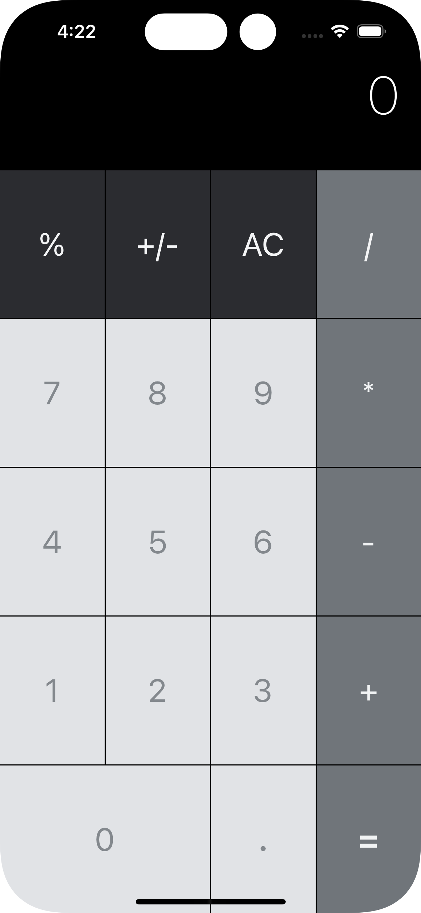

# iOS-Calculator
R.I.P README.md 10th November 2022 6:42 AM

  

Very basic iOS Calcululator with autoLayout applied for three screen positions. Calcultor is not designed to distinguish between first and second row operations. Each press of operation button is performing pressed operation between first pressed button and last pressed button.

  
  
